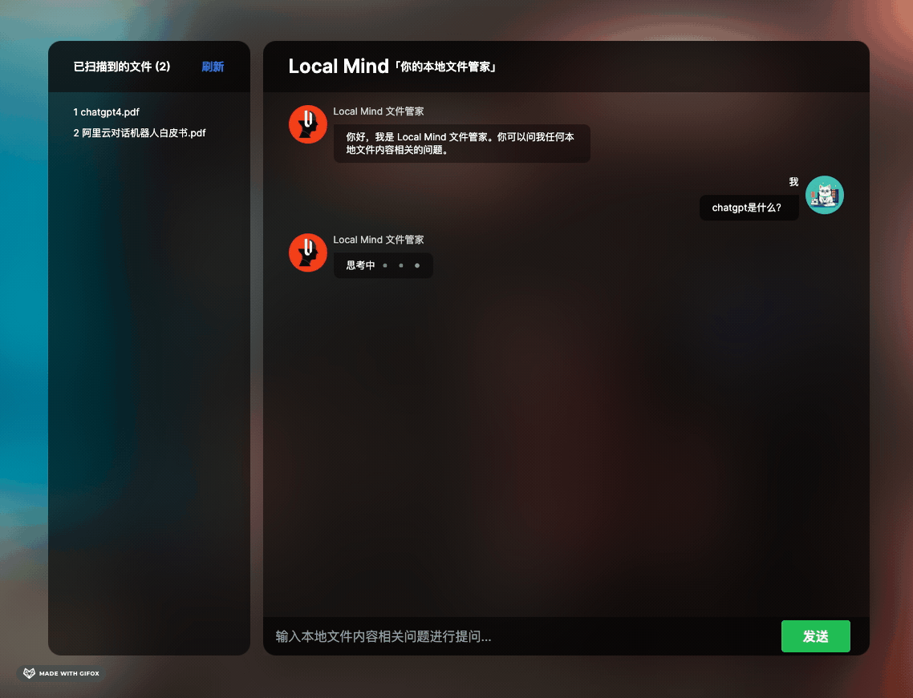

[]

# 欢迎来到 Local Mind 项目

Local Mind 是一个本地文件问答应用，它基于 LangChain HNSWLib 和 NEXT.JS 纯 JavaScript 技术栈构建, 是套壳 GPT API 垂类应用的一种工程化实践。

在看了 LangChain，还有一些 Prompt Engineering 应用场景后，有一个灵感：对于我们这些前端 API 工程师来说，基于 LangChain 这类封装优秀的库，配合上 Prompt Engineering 调戏 LLM，用 Next.JS 做一层轻量级后端路由， 最后结合上前端本职工作（设计一个交互良好的界面），就能非常容易地做出一个“套壳”大语言模型的工程应用。

不过得提醒下，这个应用目前只是周末写着玩玩的 Side Project，更多是用来工程上的探索，并没有达到生产可用的水平哦！

## 开始

### 准备工作

- 自备 API KEY: 在.env 文件中，替换 OPENAI_API_KEY 的值
- 命令行环境具备科学的上网环境 (可使用 proxychains)

```bash
npm run dev
# or
yarn dev
# or
pnpm dev
```

## 更多
